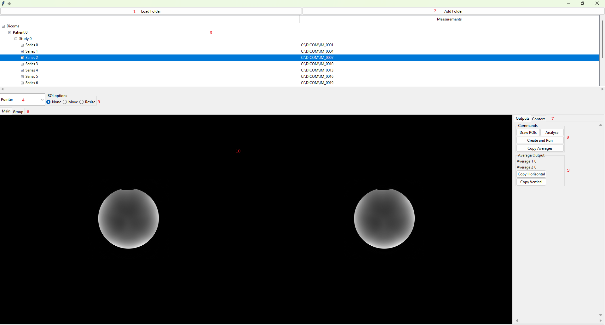
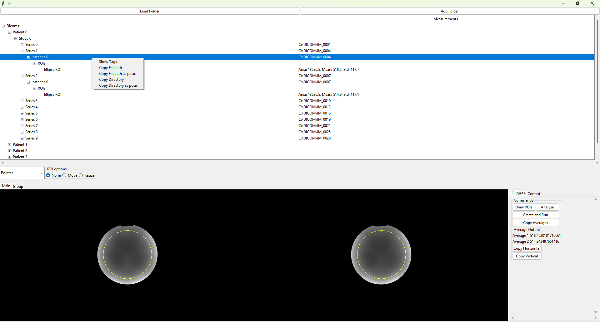
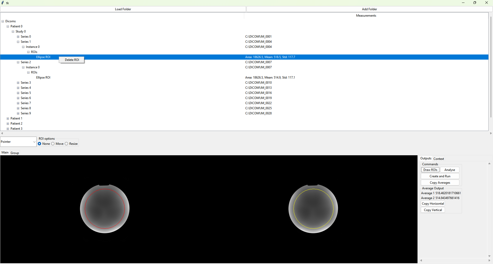
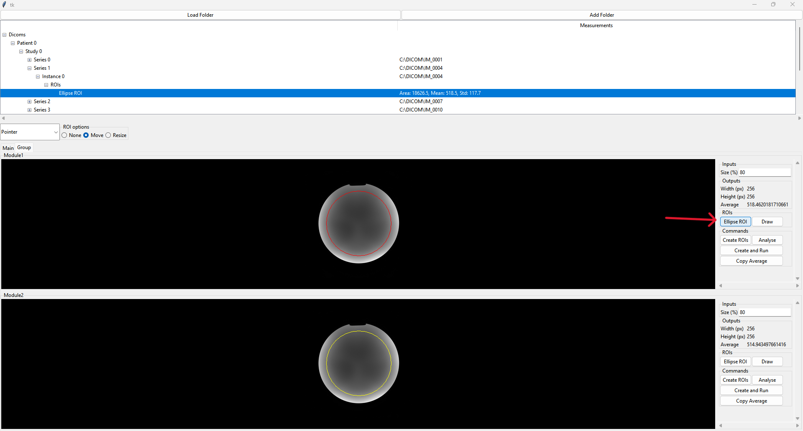
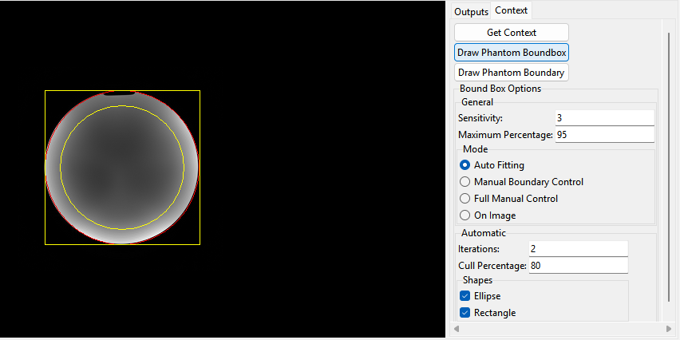
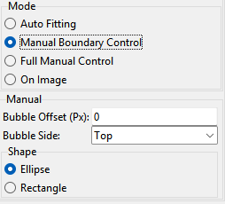
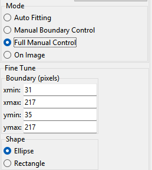

The User Interface
==================
The following goes through a collection that has been adapted from the example to use the :py:class:`AutoPhantomManager <pumpia.widgets.context_managers.AutoPhantomManager>`.

Basic Usage
-----------
The image below shows the user interface once a folder has been loaded and images dragged/dropped into the viewers.
There are ten key areas:

    #. The `Load Folder` button - the images in the folder selected will replace any already loaded.
    #. The `Add Folder` button - the images in the folder selected will be loaded into the program, this does not replace those already loaded.
    #. The image tree - this shows loaded images and ROIs. DICOM images are sorted by patient-study-series-instance. General images are sorted by filepath.
    #. The mouse option dropdown.
    #. The ROI options - used when an ROI is selected. Overrides the mouse option.
    #. Tabs to switch between the main frame and modules in the collection. Not shown when a Module is ran.
    #. Tabs to switch to see the context and inputs/outputs.
    #. Commands for the collection.
    #. Outputs for the collection.
    #. Viewers

Commands and outputs may be in different locations for modules, additionally modules contain sections for inputs and ROIs.

When the mouse is within a viewer following shortcuts are provided for user interaction:

    * Mouse wheel: Scroll through image slices.
    * Control + Mouse wheel: Zoom in/out.
    * Mouse wheel button + drag: Adjust window/level.
    * Control + R: Reset image viewing parameters.

    A collection once a folder has been loaded and images dragged/dropped into the viewers.

The Image Tree
--------------
The image tree allows the user to interact with images and ROIs.

When an image is selected and right clicked on then it has the following options:

    * Show Tags - DICOM images only, shows the DICOM tags in a seperate window.
    * Copy Filepath - copies the file path to the clipboard
    * Copy Filepath as posix
    * Copy Directory - copies the files directory to the clipboard
    * Copy Directory as posix

For DICOM images the filepath is also visible in the second column of the tree.

    DICOM menu options

When an ROI is selected it is highlighted on any viewers where it is visible.
The right click menu allows the user to delete it.
ROIs have key values shown in the second column of the tree.

    ROI menu options

ROIs in Modules
---------------
When in a modules frame then the ROIs related to that module can be interacted with.
This is either through using the button for the ROI or the draw button next to it.
The button for the ROI selects the ROI and allows you to interact with it as you would any other ROI.
The draw button allows the user to redraw the ROI on image in the relevant viewer, this button may not be available for some ROIs.

    ROI handling in a module

Context
-------
This section in the main frame allows the user to interact with the context manager for the module/collection.

The context manager shown below is the Auto Phantom Context Manager.
The attempts to automatically find a phantom in the image and work out the bounding box and shape of the phantom.
It has the following core options:

    * Sensitivity - the divisor to calculate the pixel value between the minimum and maximum where the phantom boundary is. e.g 3 would mean that the phantom boundary is defined at 33% of the maximum.
    * Maximum Percentage - instead of using the maximum uses a value where this percentage of pixel values fall below it, avoids outliers.

It then has the following modes.

Auto Fitting
^^^^^^^^^^^^
This finds positions that indicate a boundary based on the above options.
It then iteratively fits the selected shapes to the boundary positions.
Each iteration keeps the cull percentage of points.
The best fit is kept as the phantom boundary.

Manual Boundary Control
^^^^^^^^^^^^^^^^^^^^^^^
This finds a bounding box based on the above options.
It then uses the options shown to correct for a bubble in the phantom and set the shape of the phantom.

Full Manual Control
^^^^^^^^^^^^^^^^^^^
This is only available after getting the context has been attempted at least once.
It allows the bounding box and shape to be manually changed.

On Image
^^^^^^^^
This is only shown if the phantom boundary has been shown on the image.
It allows the user to change the phantom boundary like they would any other ROI.

    Auto Phantom Context Manager with the bounding box and phantom boundary shown on image

    Manual Boundary Control

    Fine Tune
